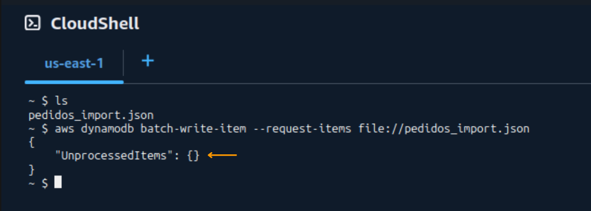
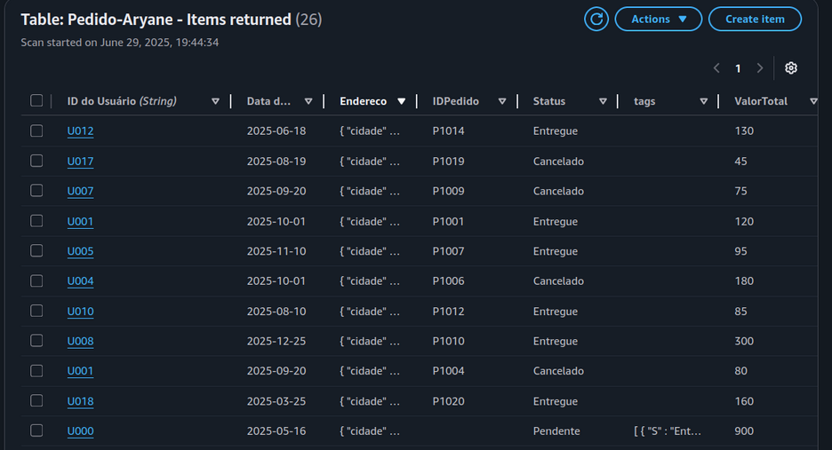
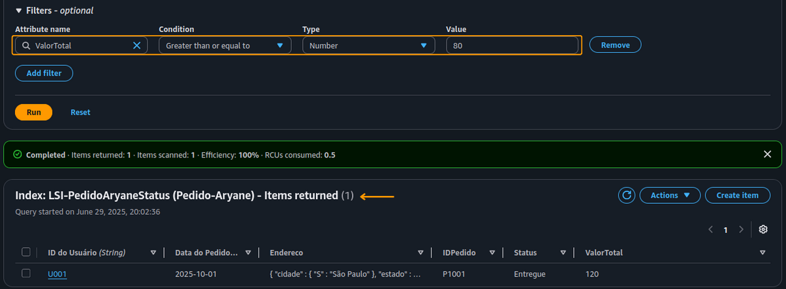
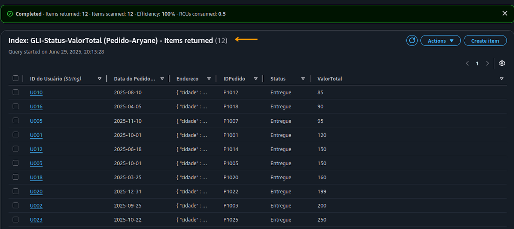
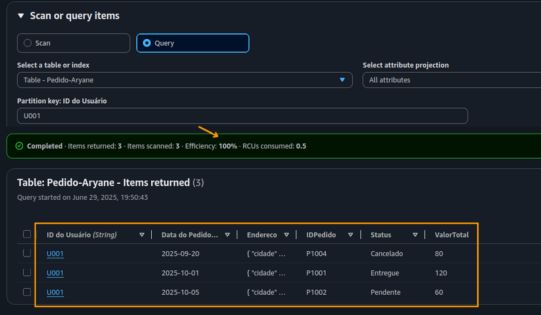

# 🔍 Laboratório Prático: Amazon DynamoDB com LSI e GSI

Este laboratório foi desenvolvido como parte da formação na **Escola da Nuvem** e tem como foco a **modelagem de dados NoSQL** utilizando **Amazon DynamoDB**, com ênfase em **índices secundários locais (LSI)** e **globais (GSI)** para otimização de consultas.

---

## 📌 Objetivo

Demonstrar na prática como criar uma tabela no DynamoDB com chave composta e configurar índices secundários para consultas eficientes, explorando a escalabilidade e flexibilidade da modelagem NoSQL.

---

## 🖼️ Arquitetura da Solução

---

## ⚙️ Atividades Realizadas

- Criação de tabela com chave composta: `UserID` (partition key) + `DataPedido` (sort key)
- Implementação de LSI para habilitar consultas por `Status` mantendo a mesma partition key
- Implementação de GSI para consultas por `Status` + `ValorTotal`, permitindo maior flexibilidade
- Inserção de dados usando `batch-write-item` via CloudShell
- Execução de queries com 100% de eficiência com base em índices

---

## 🧱 Componentes Utilizados

- **Amazon DynamoDB** – Banco de dados NoSQL gerenciado
- **CloudShell e Console da AWS** – Para criação e consultas
- **Comando `batch-write-item`** – Para inserção de dados em lote
- **Índices Secundários**:  
  - **LSI (Local Secondary Index)** – Consultas por `Status`  
  - **GSI (Global Secondary Index)** – Consultas por `Status` e `ValorTotal`

---

## 📷 Exemplos Visuais

### Importação de Dados via AWS CloudShell com CLI 
  

### Validação da Carga de Dados no Console do DynamoDB  
  

### Consulta com LSI + Filtro por ValorTotal  
  
  
### Consulta com Índice Global Secundário (GSI)
  
  
### Consulta Otimizada por Chave Primária (Query)
  

---

